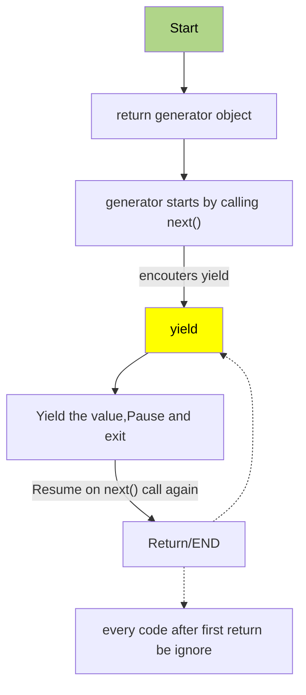

## 什么是 Generator
我们知道，普通函在所有任务执行完毕前是不能停止的，只有通过`return` 或者部抛出错误，再次调用有时从头开始执行，相反的，如何才能让一个函数中途停止执行，并且可以在停止的地方恢复函数执行呢？

答案是生成器，Generator （生成器） 是通过调用一个 `generator function` 返回的一个满足满足[迭代协议](https://developer.mozilla.org/en-US/docs/Web/JavaScript/Reference/Iteration_protocols#the_iterable_protocol)可迭代对象，

> function* 定义了一个 `generator function`, `function` 和 `*` 之间可以任意多的空格


`generator function` 调用之后返回一个 Generator 对象，可以调用它的 `next()` 方法，返回一个对象，有两个属性，`value` 和  `done`
```ts
{ 
  value: any,
  done: true|false
} 
```
当调用 `next()`返回对象的属性 `done` 的值为 `true`，表明生成器已停止，不会在生成更多的值
> 注意点：
`generator function` 调用返回需用一个变量保存，然后才可以完整的调用该对象的`next()`方法，否则每次调用`generator function`都是返回一个全新的对象，`next()`永远返回的是第一个`yield`

```js
function* generator() {
  yield 1;
  yield 2;
  yield 3;
}

const gen = generator(); // "Generator { }"

console.log(gen.next()); // { value: 1, done: false }
console.log(generator().next().value); // { value: 1, done: false }
console.log(generator().next().value); // { value: 1, done: false }
```
观察上面的`generator function`，用`yield` 关键字代替 `return`,`yield expressions` 可以理解为，函数执行到这里停止，它后面的表达式的值作为函数的返回值，存储在返回对象的 `value` 属性中

## Lifecycle


## 将 Yeild 赋值给一个变量
前面我们创建了一个最基本的例子，现在假设将 yeild 表达式赋值给一个变量看会发生什么

```js
function * gen(){
    const x = yield 1
    console.log("x:",x);
    const y = yield 2
    console.log("y:",y);
}
const generator = gen()

console.log(generator.next()); // {value: 1, done: false}
console.log(generator.next()); // x: undefined  {value: 2, done: false}
console.log(generator.next()); // y: undefined  {value: undefined, done: true}
```
x 和 y 都是 undefined ,这又是为什么呢？，如果我们向 next 传入参数又会如何？

## 向生成器传递值
调用 next()方法时，如果传入了参数，那么这个参数会传给上一条执行的 yield 语句左边的变量，例如：
```js
function * gen(){
    const x = yield 1
    console.log("x:",x);
    const y = yield 2
    console.log("y:",y);
}
const generator = gen()

console.log(generator.next(10)); // {value: 1, done: false}
console.log(generator.next(20)); // x: 20  {value: 2, done: false}
console.log(generator.next()); // y: undefined  {value: undefined, done: true}
```
解释一下
- 第一次调用`generator.next(10)`由于在此之前是没有上一个 yeild 产生的，所以传入的 10 会被抛弃
- 第二次调用传入 20 保存给上一次 yeild （也即第一次 yeild）的左边变量 x ，所以当第二次调用时候，此时 x 为 20 

## 将 yeild 传递给函数

```js
function * gen(){
    yield 1
    foo(yield 2)
}
const generator = gen()

function foo (x){
    console.log("passed agrument",x);
}

console.log(generator.next());  //{value: 1, done: false}
console.log(generator.next()); //{value: 2, done: false}
console.log(generator.next()); //passed agrument undefined {value: undefined, done: true}
```
解释：
- 第三次调用 `next` 未传入任何参数，意味前一次 yelid 表达式值为 `undefined`

## Yield*
yield* 表达式用来委托给另一个生成器，迭代的时候，等到另一个生产器迭代完毕才会继续迭代该对象

```js

function * gen(){
    yield 1
    yield * gen2()
    yield 4
}
function * gen2(){
    yield 2
    yield 3
}
const generator = gen()

generator.next() // {value: 1, done: false}
generator.next() // {value: 2, done: false}
generator.next() // {value: 3, done: false}
generator.next() // {value: 4, done: false}
generator.next() // {value: undefined, done: true}
```


## Yield* 可迭代对象
yield* 也可以迭代可迭代对象，比如 `Array`、`String`、`Map`等
```js
function * gen(){
    yield 1
    yield * [2,3]
    yield 4
    yield * 'HI'
    yield 'end'
}

const generator = gen()

generator.next()//{value: 1, done: false}
generator.next()//{value: 2, done: false}
generator.next()//{value: 3, done: false}
generator.next()//{value: 4, done: false}
generator.next()//{value: "H", done: false}
generator.next()//{value: "I", done: false}
generator.next()//{value: "end", done: false}

```
## for of 迭代生成器
上面的迭代是不断调用 next 去迭代的，生成器本质上也是一个可迭代的对象，所以可以用 `for of` 去迭代 

```js

function * gen(){
    yield 1
    yield * [2,3]
    yield 4
}

const generator = gen()

for (const item of generator) {
    console.log(item);
}

```
## 使用场景

### 按需转换数组

```js
function * transform(iterable,transformFun){
    for (const item of iterable) {
        yield transformFun(item)
    }
}
```
这个函数功能和数组的 `map()` 有啥区别呢？

- 都可以实现数组项的逐个转换
- transform 可以是按需变换，map 是一次性全部变换完毕

想象以下场景，前端我们请求回来一个大json，里面数据较多，但是 UI 列表显示的数据其实是有限的，并且UI上显示的数据需要做一定的转换，这个时候 transform 便派上了用场，可以根据鼠标滚动、或者加载更多、
下一页等实现按需转换，对性能提高有一定的帮助

### 实现一个 async await 

```js

function* fetchData() {
    const response = yield fetch('foo/xxx');
    const jsonResponse = yield response.json();
  }
const task = fetchData()

const fetchPromise = task.next().value

fetchPromise.then(data=>{
    return task.next(data)
}).then(res=>{
    console.log('response:',res);
})

```