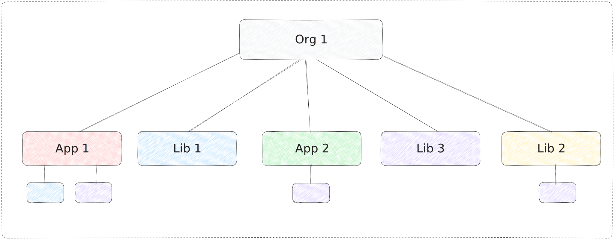
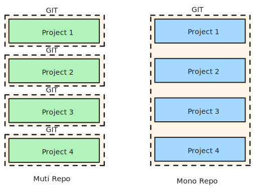

# 从入门到实践：前端 Monorepo 工程化实战
随着前端项目的规模不断扩大，如何高效管理多个相关项目成为了一个棘手的问题。特别是当你的团队同时维护着多个共享相似技术栈的应用时，可能会遇到这些困扰：重复的依赖安装、繁琐的包发布流程、不一致的工具配置等。

本文将详细介绍如何使用 `Monorepo` 来解决这些问题，我们会以实际项目为例，使用 `pnpm` 和 `Turborepo` 搭建一个高效的前端工程化方案。读完本文，你将了解：
> - `Monorepo` 是什么，以及它如何解决传统多仓库的痛点
> - 如何使用 `pnpm` 管理项目依赖和工作空间
> - 如何使用 `Turborepo` 提升构建效率
> - 实际项目中的最佳实践和注意事项

## 什么是 Monorepo

在软件开发中，`Monorepo`（"mono"意为"单一"，"repo"是"存储库"的缩写）是一种策略，它将多个项目集中在一个代码仓库中进行管理。这些项目之间通常具有一定的联系，可以共享代码或依赖，以提高开发效率。


## Monorepo 的特点

`Monorepo` 使用单一的代码仓库来管理多个项目：

- 项目之间可以通过本地依赖实现无缝共享。
- 提供统一的工具链，便于维护和协作。

例如[谷歌](https://cacm.acm.org/magazines/2016/7/204032-why-google-stores-billions-of-lines-of-code-in-a-single-repository/fulltext)管理着一个庞大的 `Monorepo` 库，包括大约 10 亿个文件，拥有约 3500 万次提交的历史，跨越了谷歌整个 18 年。[2016]

## 对比传统的多仓库（Multirepo）

下图展示了 `Multirepo` 和 `Monorepo` 的在代码仓库上区别



在传统的多仓库结构中（`Multirepo`），每个项目独立维护，可能会面临以下问题：

1. 代码共享困难
   为了共享代码，需要额外创建一个共享仓库并发布为包，增加了维护成本。
2. 代码重复
   各项目可能会重复实现相同功能，导致冗余代码和后期维护困难。
3. 工具不一致
   不同仓库可能使用不同的工具链（构建、部署、代码规范），增加了协作成本。
4. 构建效率低
   每个项目独立安装依赖，可能会多次重复构建相同的内容。
   举个例子：
   我们之前的前端仓库下，有运维平台和租户平台，技术栈相差不多，相同的依赖会重复安装到磁盘上，分别维护各自的工具配置和公共组件，不仅导致代码重复，还让统一管理和协作变得复杂。

## Monorepo 的优势

使用 `Monorepo`，以 `JavaScript` 生态为例，可以解决以上问题：

1. 代码共享简单
   在本地直接引用共享包，无需发布到 `npm` 即可使用。
2. 统一的工具链
   通过集中化管理代码规范（如 `eslint`、`typescript` 等）和工具链，减少配置成本，保证一致性。
3. 高效的构建流程
   减少重复安装依赖，利用缓存机制加速构建。

## Monorepo 在 Web 开发领域中

现代 Web 开发中通常涉及前后端，随着使用 `JavaScript` 全栈开发的流行，前后端代码和服务往往在同一个项目中协作。例如，`React`、`Vue` 等前端框架和 `Node.js`、`GraphQL` 等后端技术之间的交互性非常强，前后端复用类型、公共常量等等，这使得在同一个仓库中维护前后端代码变得更加高效。

## Monorepo 的实践

我们在一个新项目中实施了 `Monorepo`，该项目包含了运维前端（`admin`）和租户前端（`tenant`），我们将和后端交互用的 `Api` 抽象成一个独立的包。同时，我们两侧的技术栈基本一致，将相关工具的配置公共部分抽象成包，项目各自继承扩展，最后，我们将一些常用的常量、方法、`UI` 组件抽象出来，单独管理。

按照我们以往多仓库（`Multirepo`）方式，这些包分布在各个独立的仓库里，然后将包发布到公司内部或者公开的源上项目中安装导入。这种方式就会产生我前面提到的多仓库的一个缺陷，代码共享困难，在这种模式下，更新共享包（如 `@org/api`）的流程通常包括以下步骤：

1. 修改共享包代码
2. 发布新版本
3. 更新依赖该包的项目中的版本号
4. 重新安装依赖
5. 调试和验证

这个过程不仅繁琐，还可能影响开发效率。虽然在开发模式下可以使用软链接（`symlink`）来实时查看效果，但这种方法仍需手动操作，且可能引入额外的复杂性。

`Monorepo` 工具和现代依赖管理工具（如 `pnpm`、`Yarn`、`npm`）提供的 `Workspace` 功能可以有效解决这些问题：

1. 简化依赖管理：本地包可以直接被引用，无需发布和版本更新
2. 即时生效：对共享包的修改可以立即反映在依赖它的项目中
3. 统一构建：确保所有项目使用相同版本的共享包
4. 简化工作流：减少了发布、更新和重新安装的步骤


这种方法不仅提高了开发效率，还确保了项目间的一致性，是现代大型前端项目开发的推荐实践。

## Workspace 设置

通俗的说，`Workspace` 就像一个大文件夹，里面分门别类放着多个小项目（应用）或共享的工具包（模块）。这些小项目和工具包之间可以相互联系，也可以独立运作。

在 `JavaScript` 中，主流依赖管理工具均支持 `Workspace`，`pnpm` 使用 `pnpm-workspace.yaml` 配置。`npm` 和 `Yarn`，使用 `package.json` 中的 `workspaces` 字段配置。

我们选择 `pnpm` 作为我们依赖管理工具，`pnpm-workspace.yaml` 的内容如下：

```
packages:
  - "apps/*"
  - "packages/*"
```

根据上面的 `Workspace` 配置，我们把所用的应用和包，放置在一个仓库里，仓库结构如下：

```
.
├── apps
│   ├── admin
│   │   └── package.json
│   └── tenant
│       └── package.json
├── package.json
├── packages
│   ├── api
│   │   └── package.json
│   ├── eslint-config
│   │   └── package.json
│   ├── shared
│   │   └── package.json
│   ├── typescript-config
│   │   └── package.json
│   └── ui
│       └── package.json
└── pnpm-lock.yaml

```

- 应用（apps）：独立的项目（如前端、后端应用），通常相互隔离。在我们的项目中，`admin` 和 `tenant` 是两个基于 `React` 的前端应用，用 `Vite` 作为打包工具
- 包（packages）：共享的模块，我们项目中包括组件库（ui）、 前后端交互 `Api` 、代码 lint 工具配置（eslint-config）等
  一个包可以是另外一个包的依赖，也可以是应用的依赖，比如 `eslint-config` 包，可以被 `ui` 和 `api` 依赖，也可以被 `admin` 和 `tenant` 依赖
- `package.json` 文件：描述包的元数据，包括名称、版本号、依赖等，每个包或者应用*必须包含*
- 不要嵌套包或者应用，后续介绍到 `Monorepo` 工具不支持

下图展示了项目的依赖关系



### 为什么选择 `pnpm`

节省磁盘空间和提升性能 
- 独特的硬链接机制： 
- `pnpm` 使用硬链接将依赖统一存储在全局缓存中，避免重复安装，节省磁盘空间。
- `npm` 每个项目都独立存储依赖，导致浪费磁盘空间，特别是在多项目环境下。
- 安装速度更快： 
- `pnpm` 利用缓存机制显著加速依赖安装。

## Monorepo tools

设置完 `Workspace` 后，我们可以很方便的共享代码，但是还有一个问题：就是任务管理，比如你要构建应用 `admin`，你先要构建其依赖 `@org/ui`，而 `@org/ui` 又依赖 `@org/api`，此外还要考虑并行构建 `tenant` 加快构建速度。这些复杂的任务管理，需要一个工具支持。一个优秀的 `Monorepo` 工具通要常具备以下能力：


1. 本地计算缓存
   未改变的文件跳过重复构建，提升效率。
2. 任务编排
   确保任务按依赖顺序执行，例如在构建应用前，先构建其依赖包。
3. 分布式计算缓存
   允许开发环境和测试环境共享构建缓存（视具体条件实现）。
4. 分布式任务执行
   支持在多台机器上并行运行任务，缩短构建时间。
5. `Workspace` 分析
   提供项目全貌，帮助开发人员快速理解代码结构。
6. 依赖可视化
   直观展示项目和任务的依赖关系。

目前有很多开源的 `Monorepo` 工具

- `Bazel`: by `Google`，支持多语言，公司级的工程化工具，非常复杂
- `Lerna`: `JavaScript` 社区曾经最流行的工具，后面一段时间作者停止维护了，现在由 `Nx` 团队维护
- `Nx`: 号称下一代构建系统，对 `monorepo` 的支持很好，支持插件、高级持续集成配置，包括缓存和分布式执行任务，功能相对完善
- `Turborepo`: 一个由 `Vercel` 团队开发的新 `Monorepo` 工具，用 `Rust` 编写，用于 `JavaScript/TypeScript` 开发

`Bazel` 适合大型组织，`Lerna` 专注包管理，可以被包管理工具（`pnpm`）代替，`Nx` 功能更加强大，相对的学习路线比较陡峭，`Turborepo` 简单易用，比较适合我们的需求

## Turborepo 安装配置

`Turborepo` 是运行在 `Workspaces` 上层，我们已经用 `pnpm` 配置好了 `Workspace`，下面开始安装配置 `Turborepo`，这是简化步骤，更多细节参考文档 [getting-started](https://turbo.build/repo/docs/getting-started)

1. 安装，可以选择全局安装或者安装到项目中

```bash
# Global install
pnpm add turbo --global
# Install in repository
pnpm add turbo --save-dev --workspace-root
```

2. 添加配置文件 `turbo.json`，参考文档[ Configuration Options](https://turbo.build/repo/docs/reference/configuration)

```json
{
  "tasks": {
    "build": {
      "dependsOn": ["^build"],
      "outputs": ["dist/**"]
    },
    "dev": {
      "persistent": true,
      "cache": false
    }
  }
}
```

`dependsOn` 字段，任务开始前必须完成的任务。用法参考[configuring-tasks](https://turbo.build/repo/docs/crafting-your-repository/configuring-tasks)

`outputs` 字段，任务的输出，不指定，`turbo` 就不会缓存，`turbo` 会在本地缓存构建，如果某个依赖或者应用没有更改，`turbo` 就不会重新构建。

3. 项目根目录下 `package.json` 添加脚本等

```
+  "scripts": {
+    "build": "turbo build",
+    "dev": "turbo dev",
+    "lint": "turbo lint"
+  },
+  "packageManager": "pnpm@9.1.2",
```

4. 运行任务，参考[running-tasks](https://turbo.build/repo/docs/crafting-your-repository/running-tasks)

## Turborepo 常见问题和解决方案

在使用 `Turborepo` 的过程中，你可能会遇到以下常见问题：

#### 1. 缓存相关问题

**问题**: 明明代码没有改变，但 `Turborepo` 没有使用缓存，每次都重新构建
**解决方案**: 
- 检查 `turbo.json` 中的 `outputs` 配置是否正确指定了所有输出文件
- 确保 `package.json` 中的 `scripts` 命令是确定性的，不包含随机性（如时间戳）
- 使用 `turbo build --dry` 命令查看任务的依赖关系和缓存状态

**问题**: 想要强制清除缓存重新构建
**解决方案**:
```bash
# 运行时跳过缓存
turbo build --force
```

#### 2. 任务编排问题

**问题**: 任务执行顺序不符合预期
**解决方案**:
```json
{
  "tasks": {
    "build": {
      "dependsOn": ["^build"], // ^表示依赖项的build任务
      "outputs": ["dist/**"]
    },
    "test": {
      "dependsOn": ["build"], // 依赖当前包的build任务
      "outputs": []
    }
  }
}
```

**问题**: 开发时某些任务不需要缓存
**解决方案**:
```json
{
  "tasks": {
    "dev": {
      "cache": false,
      "persistent": true
    }
  }
}
```
#### 3. 调试技巧

- 使用 `turbo run build --graph` 生成任务依赖图，帮助理解和优化任务流
- 使用 `--dry` 参数预览任务执行计划：`turbo build --dry`
- 使用 `TURBO_LOG_VERBOSITY=high` 环境变量查看详细日志


## 如何开发一个包

开发一个包，共享给应用或者其他的包，是 `Monorepo` 的核心功能

### 基础代码规范配置

`@org/eslint-config` 是我们项目的基本的 `eslint` 配置，我们希望每个包和应用，不各自再维护这么基础的配置，统一使用 `@org/eslint-config`，保证团队项目的代码风格一致，这个包不需要构建和开发等任务，包含你定义的文件即可

*/packages/eslint-config/package.json* 部分内容如下

```json{2,6,7}
{
  "name": "@org/eslint-config",
  "version": "0.0.1",
  "private": true,
  "files": [
    "library.js",
    "react-internal.js"
  ]
}
```

`library.js` 用于纯 `JavaScript` 项目，`react-internal.js` 用于 `React` 项目，如何使用呢？比如在 `admin` 项目中

首先在 */apps/admin/package.json* 添加依赖

```json{3}
{
  "devDependencies": {
    "@org/eslint-config": "workspace:*"
  }
}
```

workspace:\* 表示从你的 `Workspace` 中引用，不必从网络上获取，等到这些包发布的时候，会被动态的替换为对应的版本号。
然后在 /apps/admin/.eslintrc 中引用

```json
{
  "extends": ["@org/eslint-config/react-internal.js"]
}
```

这样在 `admin` 项目中，就可以使用 `@org/eslint-config` 的配置，其他应用或者包同理，大家基于同一个代码规范配置开发，不必各自维护自己的代码规范配置

### 前后端交互 Api

这个包包含前后端交互的所有 `Api`，底层基于 `HTTP` 请求工具 `Axios`。这个包不仅要导出出各个模块的交互用的 `Api` 函数，还要包含 `JSON` 响应的类型 `Model`，此外后端返回的数据，不可能包含 `UI` 上需要的所有信息，特别是一些枚举值的映射，我们的做法是维护在前端和类型 `Model`，一起都由 `Api` 这个包导出

*/packages/api/package.json* 部分内容如下

```json
{
  "name": "@org/api",
  "version": "0.0.0",
  "private": true,
  "scripts": {
    "dev": "tsc --watch",
    "build": "tsc"
  },
  "main": "./dist/index.js",
  "types": "./dist/index.d.ts",
  "exports": {
    "./user": {
      "types": "./dist/user/user.d.ts",
      "default": "./dist/user/user.js"
    },
    "./order": {
      "types": "./dist/order/order.d.ts",
      "default": "./dist/order/order.js"
    }
  }
}
```

推荐用 `package.json` 的 `exports` 字段定义导出，使用的时候和 `@org/eslint-config` 一样，先在 /apps/admin/package.json 添加依赖，然后在代码中引入，示例如下

```ts
import { fetchUser, type User } from "@org/api/module1";
```


## 我的 Monorepo 实践心得

在使用 `Monorepo` 的过程中，我总结了一些个人经验和思考，希望能给大家一些参考：

### 从小规模开始

刚开始接触 `Monorepo` 时，我也被各种工具和配置搞得有点晕。后来我意识到，与其一开始就追求完美的工程配置，不如从小规模开始尝试。我的建议是：

1. 把最常用的共享代码先抽出来
2. 随着项目发展，逐步完善工程化配置

这样循序渐进的方式，让团队有足够的时间适应这种新的开发模式。

### 意想不到的收益

除了预期中的代码复用和工程化统一，`Monorepo` 还带来了一些意想不到的好处：


1. **更容易进行全局重构**
   - 重构时能确保所有项目同步更新 ，比如你重构了一个 `@org/api` 里请求的方法名称，所有导入的地方都会自动更新

2. **团队协作更顺畅**
   - 团队成员之间更容易共享最佳实践，比如我们项目中常用的增删改查页面，可以抽离出来，供团队成员共享

### 需要注意的坑

当然，使用 `Monorepo` 也不是没有挑战：

1. **仓库体积增长以及权限管理**
   - 代码都在一个仓库，对所有人都可见，这是 `Monorepo` 的特点，但是有时存在有的应用或者包对某些团队不可见，就需要权限的管理
   - 随着时间的增长，整个仓库体积会越来越大，检出仓库会有性能问题
   - 我们仓库较小，没有遇到以上问题，但是这些都是客观存在的，需要考虑 

2. **包的边界划分**
   - 不要过度拆分包，这可能会带来不必要的复杂性，比如接口的 `JSON` 响应类型，我曾计划拆分一个 `@org/types` 的包，相当于类型和接口分开了，考虑到我们规模小，写在一起简单方便。
