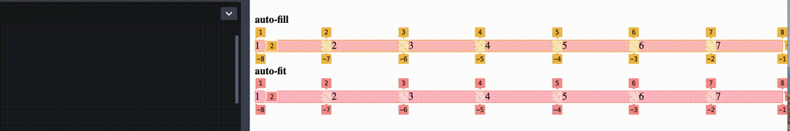

`minmax()` CSS 函数定义了一个尺寸范围：大于等于最小值或者小于等于最大值，配合 grid 布局使用。

#### 从一个简单的例子开始

```css
grid-template-columns: minmax(20px, 100px) 1fr 1fr;
```
上面代码会将一个grid盒子：
- 划分 3 列
- 第一列的宽度是`minmax(20px, 100px)`,最小宽度`20px`，最大宽度是`100px`
- 另外两列的宽度是`1fr`，均分剩余空间（remaining space）

`minmax()`函数会校验参数
- 如果最小值`minmax(min,max)`大于最大值，那么最大值会被忽略，此时最小值被当作其值
- `1f` 只能用作最大值，不能用作最小值，如果用作最小值，这条声明无效

`minmax()`函数配合`repeat`函数
下面是 grid 布局中经常用到的一种声明
```css
.container {
  display: grid;
  grid-template-columns: repeat(3, minmax(200px, 1fr));
  grid-gap: 1rem;
}
```
但是上面的声明有个不完美的点，如果列数不是固定的，当 viewport 宽度不足会导致出现横向滚动条，我们希望宽度不足的时候自动换行，在 grid 布局中，我们可以使用`auto-fit` 或者 `auto-fill` 关键字进行换行

- `auto-fill` 尽可能多的填充列，所以会创建出多余的隐藏列
- `auto-fit` 适配当前列，可能让多利用可分配空间

不同之处在当视口足够宽可以添加额外的列的时候，这两个关键字对列的处理方式。当行的宽度能添加一个新的列，浏览器有两种处理方式
1. 允许扩展新的列
2. 也会扩展新的列，但是这个新的列折叠，本应有的宽度被分配给其他列，会影响其他列尺寸和位置

对应的，`auto-fill` 就是第一种处理方式，只要允许的宽度能扩展新的列，那就扩展，即使没有内容填充，`auto-fit` 不同的是，新扩展的列被折叠，视觉表现上，感觉是原有的列均分了行的宽度
视频示意，注意 `auto-fit` 列数是在增加的当有足够的空间


#### 一些用例

大概是使用率最高的一个了
```css
.container {
  display: grid;
  grid-template-columns: repeat(auto-fill, minmax(200px, 1fr));
  grid-gap: 1rem;
}
```
但是上面这个有一个问题，就是当视口宽度小于 `200px`时候会出现横向滚动条，一般有两种处理方式，当然也可以不处理
最先想到就是用媒体查询
```css
.container {
  display: grid;
  grid-template-columns: 1fr;
  grid-gap: 1rem;
}

@media (min-width: 250px) {
  .wrapper {
    grid-template-columns: repeat(auto-fill, minmax(20px, 1fr));
  }
}

```
另外一种思路是配合`min()`函数
```css
.container {
  display: grid;
  grid-template-columns: repeat(auto-fill, minmax(min(100%,200px), 1fr));
  grid-gap: 1rem;
}
```
上面代码表示，如果视口宽度小于`200px`则`minmax()`的第一个值是`100%`等于父元素宽度，否则是`200px`

另外一个例子，文章布局

第一列和最后一列是间隙，中间是我们阅读区域，`minmax(auto, 70ch)` 表示这列最大宽度是 70 个字符，一个比较舒适阅读的区域
```css
.container {
  display: grid;
  grid-template-columns: minmax(1rem, 1fr) minmax(auto, 70ch) minmax(1rem, 1fr);
  grid-gap: 1rem;
}
```
<p class="codepen" data-height="265" data-theme-id="light" data-default-tab="html,result" data-user="tao1874" data-slug-hash="VwpYpzK" style="height: 265px; box-sizing: border-box; display: flex; align-items: center; justify-content: center; border: 2px solid; margin: 1em 0; padding: 1em;" data-pen-title="VwpYpzK">
  <span>See the Pen <a href="https://codepen.io/tao1874/pen/VwpYpzK">
  VwpYpzK</a> by tao1874 (<a href="https://codepen.io/tao1874">@tao1874</a>)
  on <a href="https://codepen.io">CodePen</a>.</span>
</p>
<script async src="https://cpwebassets.codepen.io/assets/embed/ei.js"></script>
