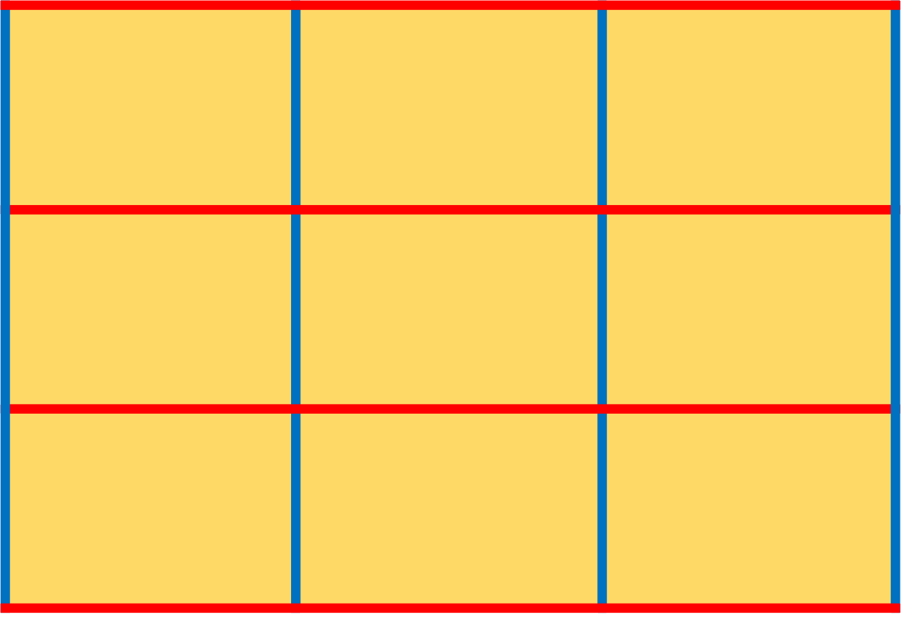
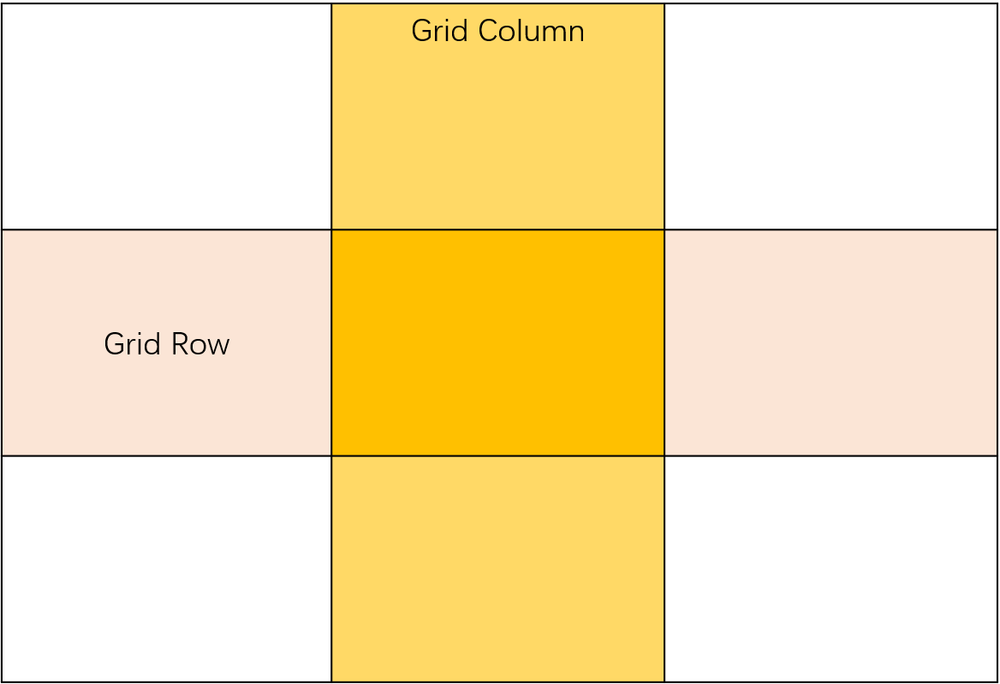
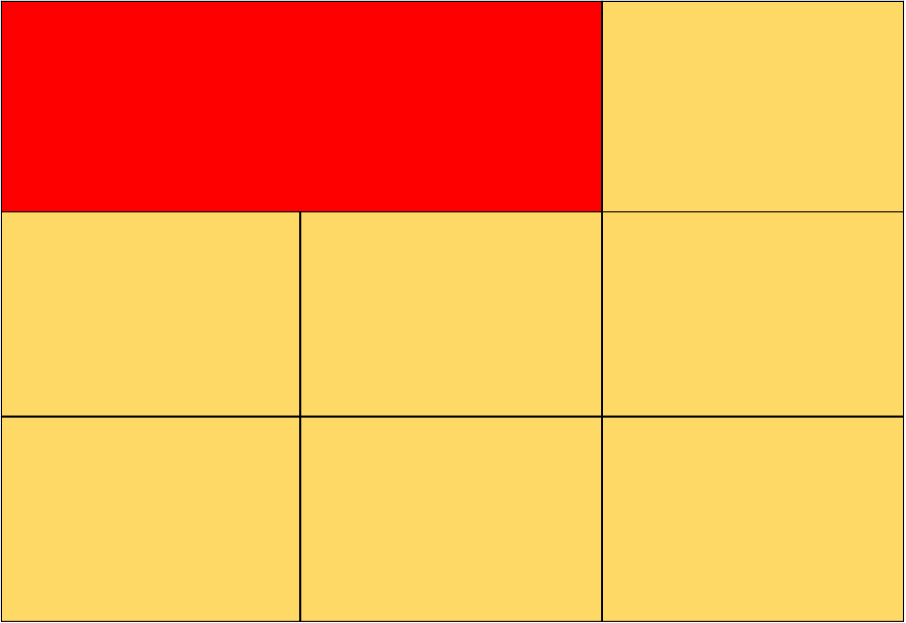
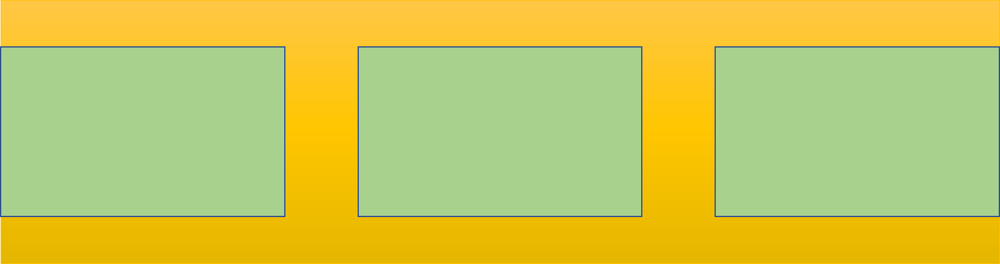
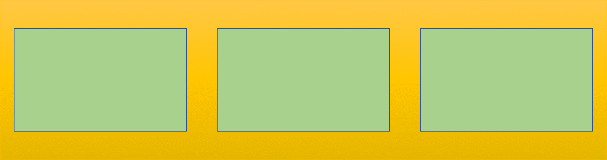
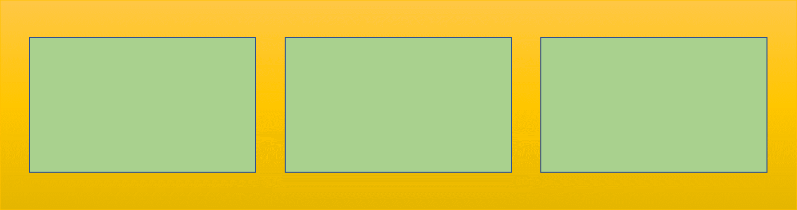

网格布局(`Grid`)是一种将网页划分成网状的格子的一种布局方案，可以想象成表格，单元格之间可以跨行或者跨列合并，可以比`flex`组合出来更加复杂的网页布局。

## 一、基本术语

#### Grid Container（容器）

我们通过在元素上声明 `display：grid` 或 `display：inline-grid` 来创建一个网格容器。一旦我们这样做，这个元素的所有直系子元素将成为网格元素。

我们对`.box` 的元素设置`display：grid`，则`.box`元素便成为`容器`

```html
<div class="box">
    <p>itme1</p>
    <p>itme2</p>
    <p>itme3</p>
</div>
```

#### Grid Item （项目）

容器的直接子元素称为（item)，和`flex`类似，上个例子中，三个`p`标签就是项目

#### Grid Lines (网格线)




上图中红色和蓝色的线网格线，理论上要形成  N 个格子，需要 N+1 条线条，网格线也可以被命名，后面会介绍

#### Grid Row （网格行）和 Grid Column (网格列)




网格水平轨道，也就是两根水平方向的`Grid line`形成的区域就是`Grid Row`，

同理，垂直方向的叫做网格列`Grid Column`

#### Grid Cell (网格单元格)

`Grid Row` 和`Grid Column`交织形成的区域就是单元格

#### Grid Area (网格区域)


网格元素可以向行或着列的方向扩展一个或多个单元，并且会创建一个网格区域。上图高亮（红色）代表一个网格区域

## 二、属性

`Grid`布局拥有较多属性，完全记忆有一定的困难，但是基本可以分为两类，容器属性和项目属性，容器属性作用于容器，项目属性作用于项目本身

### 容器属性

#### grid-template-columns 和 grid-template-rows

这两个属性是给网格做划分用的，`grid-template-columns`指定网格每一列的尺寸，`grid-template-rows`指定每一行的尺寸

<p class="codepen" data-height="265" data-theme-id="dark" data-default-tab="css,result" data-user="tao1874" data-slug-hash="ZdWObW" style="height: 265px; box-sizing: border-box; display: flex; align-items: center; justify-content: center; border: 2px solid; margin: 1em 0; padding: 1em;" data-pen-title="grid布局demo">
  <span>See the Pen <a href="https://codepen.io/tao1874/pen/ZdWObW/">
  grid布局demo</a> by tao1874 (<a href="https://codepen.io/tao1874">@tao1874</a>)
  on <a href="https://codepen.io">CodePen</a>.</span>
</p>
<script async src="https://static.codepen.io/assets/embed/ei.js"></script>
[上面代码](<https://codepen.io/tao1874/pen/ZdWObW>)划分出一个`3 x 3` 的网格，每行高度100px，每列宽度100px。除了使用绝对单位也可以使用相对单位比如：

```css
.box {
        display: grid;
        grid-template-columns: 33.3% 33.3% 33.3%;
        grid-template-rows: 100px 100px 100px;
      }
```

对于，规律明显的重复，可以通过使用`repeat()`函数，接收两个参数，第一个是重复次数，第二个是重复模板，比如

```css
.box {
    display: grid;
    /* grid-template-columns: 100px 100px 100px; */
    grid-template-columns: repeat(3,100px);
    grid-template-rows: 100px 100px 100px;
}
```

`repeat`语句也可以只是重复轨道列表中的一部分

```css
.box {
        display: grid;
        grid-template-columns:10px repeat(3, 100px) 20px;
        grid-template-rows: 100px 100px 100px;
      }
```

上面的代码表示，最开始处是一个`10px`宽的一列，然后重复出现 3 个 `100px`宽的列，最后是一个`20px`宽的列。`repeat`语法还可以重复一种模式：

```css
.box {
    display: grid;
    grid-template-columns:repeat(3,100px 200px 300px);
    grid-template-rows: 100px 100px 100px;
}
```

上面代码表示形成的列宽将是 `100px 200px 300px` `100px 200px 300px` `100px 200px 300px`

#### fr单位

`Grid`布局引入了一种全新的单位`fr`，表示网格容器中可用空间的一等份，比如[下面代码](https://codepen.io/tao1874/pen/pXbJjZ)将创建三个宽度相等的列，这些列的宽会随着容器的宽自适应

<p class="codepen" data-height="265" data-theme-id="0" data-default-tab="css,result" data-user="tao1874" data-slug-hash="pXbJjZ" style="height: 265px; box-sizing: border-box; display: flex; align-items: center; justify-content: center; border: 2px solid; margin: 1em 0; padding: 1em;" data-pen-title="grid布局demo-fr">
  <span>See the Pen <a href="https://codepen.io/tao1874/pen/pXbJjZ/">
  grid布局demo-fr</a> by tao1874 (<a href="https://codepen.io/tao1874">@tao1874</a>)
  on <a href="https://codepen.io">CodePen</a>.</span>
</p>
<script async src="https://static.codepen.io/assets/embed/ei.js"></script>
#### auto-fill 关键字

项目尽可能的重复，填充满轨道，并且不至于从轨道溢出

<p class="codepen" data-height="265" data-theme-id="dark" data-default-tab="css,result" data-user="tao1874" data-slug-hash="agmNBx" style="height: 265px; box-sizing: border-box; display: flex; align-items: center; justify-content: center; border: 2px solid; margin: 1em 0; padding: 1em;" data-pen-title="grid布局demo-fr">
  <span>See the Pen <a href="https://codepen.io/tao1874/pen/agmNBx/">
  grid布局demo-fr</a> by tao1874 (<a href="https://codepen.io/tao1874">@tao1874</a>)
  on <a href="https://codepen.io">CodePen</a>.</span>
</p>
<script async src="https://static.codepen.io/assets/embed/ei.js"></script>
上面的代码，表示每列宽`100px`，如果没有足够的空间放下`100px`的列，将自动换行

#### minmax()函数

`minmax()`函数用来产生一个范围，正如其名，产生一个介于最小值最大值的长度范围，其中，第一个参数是最小值，第二个参数是最大值 ，例如`minmax(100px,200px)`将生成介于`100px ~ 200px`的长度范围。

#### auto 关键词

`auto`关键字行为，浏览器会自动为其分配空间，行为表现为，将剩余空间拉伸至最大

<p class="codepen" data-height="265" data-theme-id="dark" data-default-tab="css,result" data-user="tao1874" data-slug-hash="rEMeEX" style="height: 265px; box-sizing: border-box; display: flex; align-items: center; justify-content: center; border: 2px solid; margin: 1em 0; padding: 1em;" data-pen-title="grid-auto">
  <span>See the Pen <a href="https://codepen.io/tao1874/pen/rEMeEX/">
  grid-auto</a> by tao1874 (<a href="https://codepen.io/tao1874">@tao1874</a>)
  on <a href="https://codepen.io">CodePen</a>.</span>
</p>
<script async src="https://static.codepen.io/assets/embed/ei.js"></script>
#### grid-gap 

`grid-gap`属性是`grid-row-gap`和`grid-column-gap`简写形式

```css
.box {
        display: grid;
        grid-gap: 20px 30px;
      }
```

上面代码表示，创建出来的网格水平轨道之间的间距是20px,垂直方向的轨道间距是30px，如果省略第二个值，则默认等于第一个值。当然也可以单独声明`grid-row-gap`或者`grid-column-gap`

#### grid-template-areas 

网格区域，可以将一个或多个单元格组成一个区域，下面例子可以很轻松实现一个常用的`layout`

<p class="codepen" data-height="265" data-theme-id="dark" data-default-tab="css,result" data-user="tao1874" data-slug-hash="ZdBePJ" style="height: 265px; box-sizing: border-box; display: flex; align-items: center; justify-content: center; border: 2px solid; margin: 1em 0; padding: 1em;" data-pen-title="grid-area">
  <span>See the Pen <a href="https://codepen.io/tao1874/pen/ZdBePJ/">
  grid-area</a> by tao1874 (<a href="https://codepen.io/tao1874">@tao1874</a>)
  on <a href="https://codepen.io">CodePen</a>.</span>
</p>
<script async src="https://static.codepen.io/assets/embed/ei.js"></script>
如果在划分网格的时候，指定了网格区域名称，但是未进行网格线的命名，则该区域网格线的名称随之改为`areaName-start` 和 `areaName-end`，比如上面示例中的`header`区域，其左边边框所在的网格线叫做`header-start`右边的边框所在的网格线叫做`header-end`

#### grid-auto-flow

单元格放置规则，默认是先行后列，即先填充第一行，第一行满了，再填充第二行。

```css
.box{grid-auto-flow:row |row dense|column|column dense }
```

默认是`row`先行后列，`column`先列后行，`dense`意思紧密，这种情况用于某些项目设置了固定值以后剩余的项目如何放置，

<p class="codepen" data-height="265" data-theme-id="dark" data-default-tab="css,result" data-user="tao1874" data-slug-hash="zVNzGb" style="height: 265px; box-sizing: border-box; display: flex; align-items: center; justify-content: center; border: 2px solid; margin: 1em 0; padding: 1em;" data-pen-title="grid-auto-flow">
  <span>See the Pen <a href="https://codepen.io/tao1874/pen/zVNzGb/">
  grid-auto-flow</a> by tao1874 (<a href="https://codepen.io/tao1874">@tao1874</a>)
  on <a href="https://codepen.io">CodePen</a>.</span>
</p>
<script async src="https://static.codepen.io/assets/embed/ei.js"></script>
#### justify-items

网格在水平维度上的呈现方式，可以取值`stretch | start | end | center`默认是`stretch`

- `start`网格在水平方向上，宽度收缩至内容宽度，并且沿着网格线左侧对齐
- `end`网格在水平方向上，宽度收缩至内容宽度，沿着网格线右侧对齐
- `center`网格在水平方向上，宽度收缩至内容宽度，在网格区域居中对齐

#### align-items

网格在垂直维度上的呈现方式，取值`stretch | start | end | center`默认是`stretch`，在表现上，`stetch`表现拉伸至网格的高度，其他三项表现为，高度在垂直方向上收缩到内容高度，对齐方式`start`是沿着上网格线，`end`是下网格线，`center`是垂直居中

#### place-items 

这个属性是`align-items`属性和`justify-items`属性的合并简写形式

```css
.box {
    place-items: start center;
}
```

####  justify-content

```css
.box{
     display: grid;
    justify-content: stretch | start | end | center | space-between | space-around | space-evenly;
}
```

这个属性，基本上与`flex` 的`justify-content`属性表现一致，只有项目的总宽度小于网格容器的宽度，才会有效果

`stretch`默认值，如果项目设置一个死值，则没有效果

`start`左侧对齐

`end`右侧对齐

`center`居中对齐

`space-between`，两端对齐，剩余空间在中间均匀分配，示意图如下



`space-around`，意思是每个项目外侧的边距都是一样的，最终结果就是两侧的项目的边距是其他间隙的一半



`space-evenly`每个项目两册的间距都是一样的




#### align-content

`align-content`指定了项目在垂直方向上的放置规则，`align-content`和`justify-content`相似，只是换了方向而已，这里不再赘述。

#### place-content

`place-content`是`align-content`和`justify-content`的简写形式

#### grid-auto-columns 和 grid-auto-rows 

如果声明的行和列不能够充分放置所有的项目，浏览器会自动创建行和列，保证完全放置所有项目，这两个属性就是用来指定浏览器新增的行列大小的，不指定默认为内容的大小

```css
.box {
    grid-auto-columns:200px;
    grid-auto-rows:100px;
}
```

上面代码表示，新增行高100px，列宽200px

### 项目属性

#### grid-column-start 、grid-column-end  

`grid-column-start`指定该项目左边框所在的网格线，`grid-column-end`指定右边框所在的网格线，例如：

```css
.item {
    grid-column-start:1;
    grid-column-end:3;
}
```

上面代码，表示`.item`左起第一根网格线，结束于第三根网格线，跨域了两根网格线。上面的代码也可简写下面这样：

```css
.item {
    grid-column: 1 / 3 ;
      /* 或者 span 表示跨越*/
    grid-column: span 2;
}
```

#### grid-row-start 、grid-row-end 

这两个属性是指定项目在横向上上下边框所在的网格线，也可以实现跨越，语法与上述`grid-column-start`、`grid-column-end`基本类似，简写是`grid-row`

```css
.item {
     grid-column: span 2;
     grid-row: span 2;
}
```

上面表示`.item`项目在水平方向、垂直方向都跨越了两根网格线

#### grid-area

指定了项目所在的区域，

```css
.item{
    grid-area:header;
}
```

声明`.item`区域是`header`，`header`是在网格划分的时候声明的区域名称。

#### justify-self

`justify-self`声明单个网格元素水平对齐方式，取值和表现，与`justify-items`基本相同，但是只作用于单个元素

#### align-self

`align-self`声明单个网格元素垂直对齐方式，取值和表现，与`align-items`基本相同，但是只是作用单个元素

#### place-self 

这个属性是`align-self`和`justify-self`合并书写方式，记住是先垂直后水平