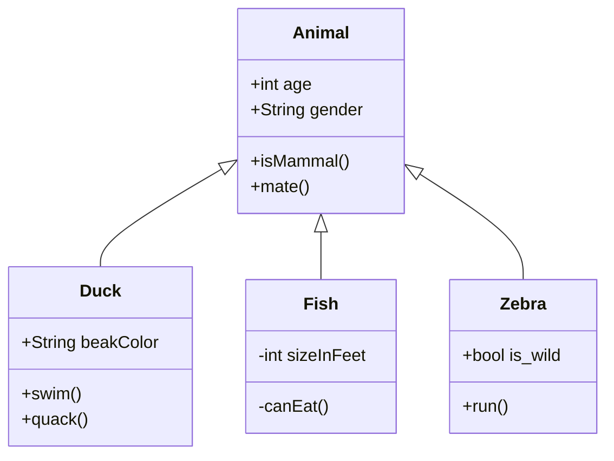

工厂方法和抽象工厂

一般来说我们都会用 `new` 操作符直接创建对象，这本身没什么问题，但是当我们的系统存在很多的具体类，实例化哪个取决于运行时的一些条件。比如根据类型创建不同的产品
```JavaScript
if (a) {
    return new ProductA()
} else if (b) {
    return new ProductB()
} else if (xxx) {
    //.......if more concrete class
}


```
如果系统内新增一个具体类的时候，我们就需要更改代码，这样的代码显然不具备伸缩性和可维护性，违反了编程中很重要的开闭原则


> 对扩展开放但是对修改封闭


如何解决这个问题，很容易的我们想到将对象的创建过程单独出来，比如有个 `createProduct ` 方法，专职创建我们需要的对象，这是最简单的工厂模式的体现，但是依旧解决不了创建者耦合具体类的问题。


依赖倒置原则提醒我们创建对象的时候要避免依赖具体类型，而是依赖抽象，我们可以在超类里声明一个抽象的创建方法，返回的是关于创建对象的抽象，然后各个子类去实现这个创建方法，子类当然知道自己需要实例化哪个类型，而客户代码并不依赖具体类型，而是依赖抽象（向上转型），当我们扩展新的具体类，并不需要更改客户的代码，完成了客户代码与具体类的解耦


