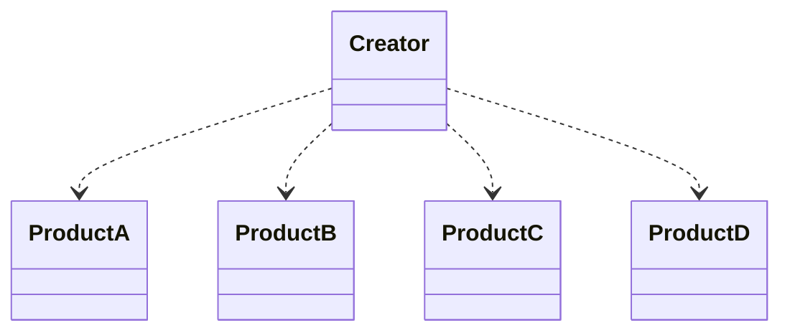
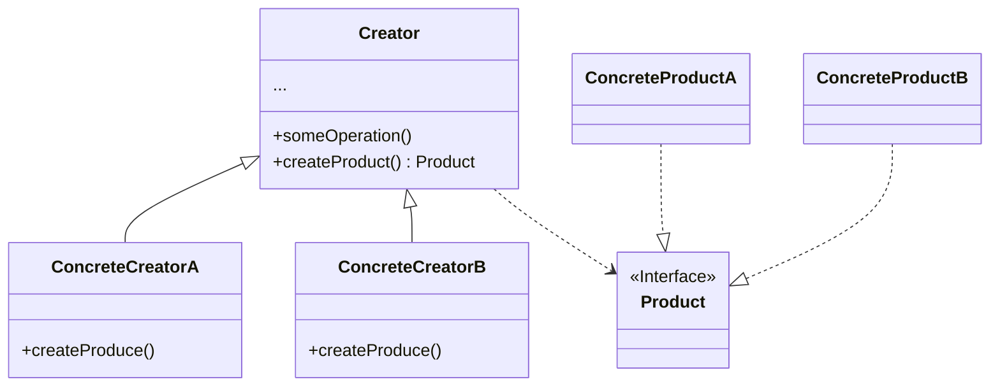

工厂方法和抽象工厂

一般来说我们都会用 `new` 操作符直接创建对象，这本身没什么问题，但是当我们的系统存在很多的具体类，实例化哪个取决于运行时的一些条件。比如根据类型创建不同的产品
```JavaScript
if (a) {
    return new ProductA()
} else if (b) {
    return new ProductB()
} else if (xxx) {
    //.......if more concrete class
}


```
如果系统内新增一个具体类的时候，我们就需要更改代码，这样的代码显然不具备伸缩性和可维护性，违反了编程中很重要的开闭原则：对扩展开放但是对修改封闭


> 客户代码耦合具体类型


如何解决这个问题，很容易的我们想到将对象的创建过程单独出来，比如有个 `createProduct ` 方法，专职创建我们需要的对象，这是最简单的工厂模式的体现，但是依旧解决不了创建者耦合具体类的问题。


依赖倒置原则提醒我们创建对象的时候要避免依赖具体类型，而是依赖抽象，我们可以在超类里声明一个抽象的创建方法，返回的是关于创建对象的抽象，然后各个子类去实现这个创建方法，子类当然知道自己需要实例化哪个类型，而客户代码并不依赖具体类型，而是依赖抽象（向上转型），当我们扩展新的具体类，并不需要更改客户的代码，完成了客户代码与具体类的解耦


代码示例：
```typeScript
/**
 * A factory method handles object creation and encapsulates it in a subclass.
 * This decouples the client code in the superclass from the object creation code in the subclass.
 * excerpt From: Eric Freeman. “Head First Design Patterns.” Apple Books. 
 */


abstract class PizzaStore {
   
    public orderPizza(type:string):Pizza {
        const pizza = this.createPizza(type)
        pizza.prepare()
        pizza.cut()
        return pizza
    }
    abstract createPizza(type:string):Pizza;
}
abstract class Pizza {
    name!:string
    prepare():void{
        console.log(`preparing ${this.name} pizza`);
    }
    cut():void {
        console.log('cuting into squares');
    }
}
class NewYorkStyleCheesePizza extends Pizza {
    name:string
    constructor(){
        super()
        this.name = "NewYork Style Cheese Pizza 🧀🧀🧀🧀"
    }
}
class NewYorkStyleVeggiePizza extends Pizza {
    name:string
    constructor(){
        super()
        this.name = "NewYork Style Veggie Pizza 🥦🥦🥦🥦"
    }
}


class NewYorkPizzaStore extends PizzaStore {
    createPizza(type:string):Pizza{
        if(type === 'cheese'){
            return new NewYorkStyleCheesePizza()
        }
        if(type === 'veggie'){
            return new NewYorkStyleVeggiePizza()
        }
        return new NewYorkStyleCheesePizza() 
    }
}
class TokyoStyelCheesePizza extends Pizza {
    name:string
    constructor() {
        super()
        this.name = "Tokyo 🇯🇵 Style Cheese Pizza"
    }
}
class TokyoPizzaStore extends PizzaStore {
    createPizza(type:string):Pizza{   
        console.log(type);
             
        return new TokyoStyelCheesePizza()
    }
}

//client code 

const newYorkPizzaStore = new NewYorkPizzaStore()
const tokyoPizzaStore = new TokyoPizzaStore()
newYorkPizzaStore.orderPizza('cheese')
newYorkPizzaStore.orderPizza('veggie')
tokyoPizzaStore.orderPizza("cheese")

```