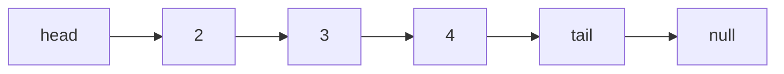

### LinkedList
`LinkedList` 是一种线性数据结构，由一系列的 `node` 组成，关键点在于每个 `node` 有一个 `next` 属性指向下一个 `node`，第一个 `node` 称为 `head` ，最后一个 `node` 为 `tail`


### 实现一

```js
// node
class Node {
    constructor(value, next = null) {
        this.value = value
        this.next = next
    }
}
class LinkedList {
    constructor() {
        this.head = null
        this.size = 0
    }

    insertFirst(data) {
        this.head = new Node(data, this.head)
        this.size++
    }
    insertLast(data) {
        const node = new Node(data)
        if (!this.head) {
            this.head = node
        } else {
            let current = this.head
            while (current.next) {
                current = current.next
            }
            current.next = node
        }
        this.size++
    }
    insertAt(data, index) {
        //index out of range
        if (index > 0 && index > this.size) {
            return
        }
        if (index === 0) {
            this.insertFirst(data)
            return
        }
        //find postion
        let count = 0
        let previous
        let current = this.head
        while (count < index) {
            count++
            previous = current
            current = current.next
        }
        previous.next = new Node(data, current)
        this.size++

    }
    removeAt(index) {
        //index out of range
        if (index > 0 && index > this.size) {
            return
        }
        let current = this.head
        let count = 0
        let previous
        if (index === 0) {
            this.head = current.next
        }
        while (count < index) {
            count++
            previous = current
            current = current.next
        }
        previous.next = current.next
        this.size--
    }
    clearList() {
        this.head = null
        this.size++
    }
    reverse(head = this.head){
        let [prev,current] = [null,head]
        while (current) {
            [current.next,prev,current]=[prev,current,current.next]
        }
        return prev
    }
}

```

实现二
```js
class LinkedList2 {
    constructor() {
        this.nodes = []
    }
    get size() {
        return this.nodes.length
    }
    get head() {
        return this.nodes[0] ?? null
    }
    get tail() {
        return this.nodes[this.size - 1] ?? null
    }
    insertAt(index, value) {

        const preNode = this.nodes[index - 1] ?? null
        const nextNode = this.nodes[index] ?? null
        const node = new Node(value, nextNode)
        if (preNode) {
            preNode.next = node
        }

        this.nodes.splice(index, 0, node)
    }
    insertFirst(value) {
        this.insertAt(0, value)
    }
    insertLast(value) {
        this.insertAt(this.size, value)
    }
    removeAt(index) {
        const pre = this.nodes[index - 1] ?? null
        const next = this.nodes[index + 1] ?? null

        if (pre) {
            pre.next = next
        }
        return this.nodes.splice(index, 1)
    }
    getAt(index) {
        return this.nodes[index] ?? null
    }
    clear() {
        this.nodes = []
    }
    reverse() {
        this.nodes = this.nodes.reduce((acc, { value }) => {
            const node = new Node(value)
            return [node, ...acc]
        }, [])
    }
    *[Symbol.iterator]() {
        yield* this.nodes
    }
}
```

### 总结
实现二比较容易理解，巧妙利用了数组存储 `node` 不用维护 `size`,此外 `reverse` 实现也很容易，其实就是数组的 `reverse`